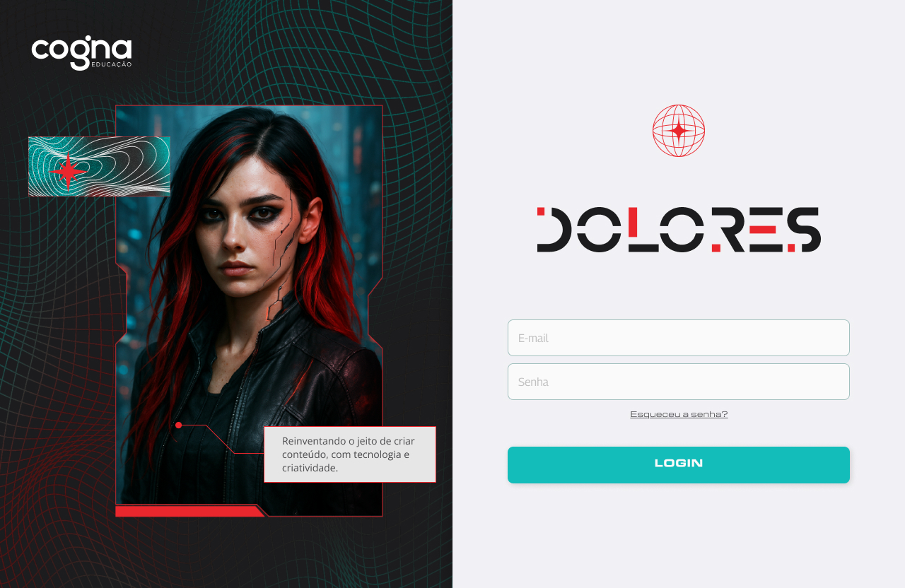

# DOLORES



_Reinventando o jeito de criar conteúdo com tecnologia e inovação._

---

## 📂 Estrutura do Projeto

```
src/
├── App.vue
├── main.ts
├── assets/
│ ├── colors.css
│ ├── grid.css
│ ├── main.css
│ ├── skeleton.css
│ ├── vue-animations.css
├── components/
│ ├── Base/
│ ├── Common/
│ ├── Content/
│ ├── Default/
│ ├── Detail/
│ ├── Home/
│ ├── Login/
├── composables/
│ ├── useDate/
│ ├── useDevice/
│ ├── useFileToBase64/
│ ├── useProvideContext/
├── layouts/
│ ├── DefaultLayout.vue
│ ├── LoginLayout.vue
├── router/
│ ├── index.ts
│ ├── routes.ts
│ ├── types.ts
├── services/
│ ├── api.ts
├── stores/
│ ├── useContentDetailStore.ts
│ ├── useContentStore.ts
│ ├── userStore.ts
├── types/
│ ├── userTypes.ts
├── views/
│ ├── AvatarDetailView/
│ ├── ContentDetailView/
│ ├── LoginView/
│ ├── NotfoundView/
│ ├── PersonaDetailView/
│ ├── ListingView/
```

---

## 🚀 Instalação

Instale as dependências do projeto:

```bash
npm install
```

Inicie o servidor de desenvolvimento:

```bash
npm run dev
```

---

## 🌟 Funcionalidades

1. **Criação de Conteúdo**
   Modal interativo para selecionar palavras-chave, personas e avatares.
   Integração com APIs para geração de conteúdo.

2. **Gestão de Personas e Avatares**
   Visualização e edição de personas e avatares.
   Upload de imagens e gerenciamento de informações detalhadas.

3. **Timer Regressivo**
   Contador regressivo com redirecionamento automático para a página inicial.

4. **Editor de Texto**
   Editor Markdown com suporte a visualização e edição responsiva.

5. **Design Responsivo**
   Layouts otimizados para dispositivos móveis e desktops.

---

## 📜 Estrutura de Componentes

**Diretório `components/`:**

- **Base**: Componentes genéricos reutilizáveis, como botões e modais.
- **Common**: Componentes compartilhados entre diferentes partes do projeto.
- **Content**: Componentes relacionados à criação e edição de conteúdo.
- **Default**: Componentes padrão, como cabeçalhos e rodapés.
- **Detail**: Componentes para exibição de detalhes de personas e avatares.

---

## 🛠️ Comandos Disponíveis

```bash
npm run dev # Inicia o servidor de desenvolvimento
npm run build # Gera a build de produção
npm run lint # Executa o linter para verificar problemas no código
```

---

## 📄 Licença

Este projeto está licenciado sob a MIT License.

---

## 🤝 Contribuição

Contribuições são bem-vindas! Siga os passos abaixo para contribuir:

1. Faça um fork do projeto.
2. Crie uma branch para sua feature:
   \`git checkout -b minha-feature\`
3. Commit suas alterações:
   \`git commit -m 'feat: minha nova feature'\`
4. Envie para o repositório remoto:
   \`git push origin minha-feature\`
5. Abra um Pull Request.
